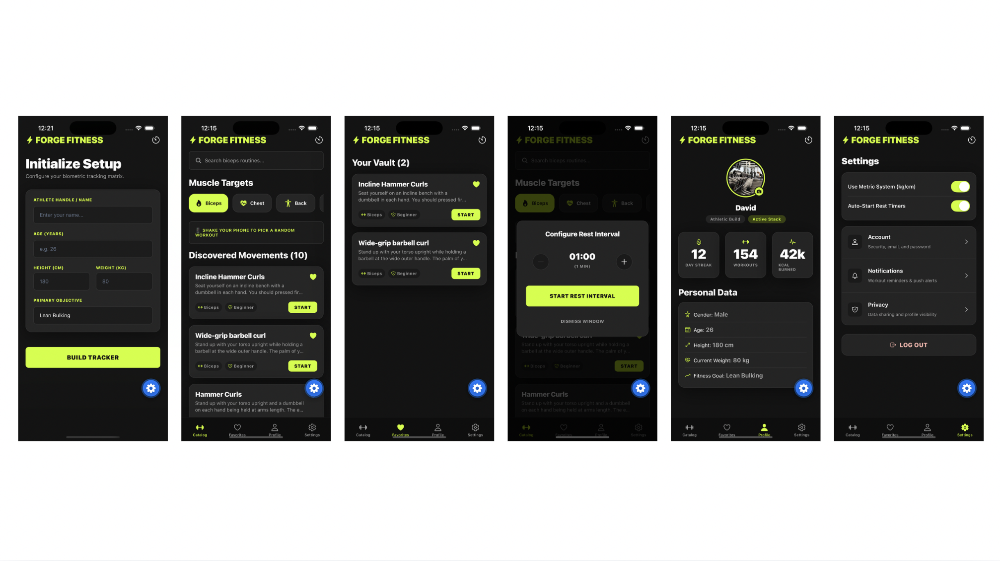

# Forge Fitness

## Project Usefulness

Forge Fitness is a mobile training platform designed to eliminate workout-planning friction by providing athletes with immediate access to structured exercise discovery, rest tracking, and biometric logging. The app allows users to seamlessly filter movements by specific muscle groups, view step-by-step instructions, and save routines to a personalized favorites vault. With built-in features like a sensor-driven "shake-to-suggest" exercise picker and an isolated rest timer with silent local notifications, it serves as a highly interactive, distraction-free digital training log that keeps workouts efficient and structured.

## High-Level Technical Architecture

The application is engineered with React Native and Expo utilizing a modular, feature-driven directory structure. Routing and view transitions are handled natively via Expo Router's file-based system, decoupling navigation from core presentation screens. Application state and the global favorites engine are driven by React Context, while user biometrics and saved routines are persisted locally across sessions. Native device features—such as hardware accelerometer streams, tactile haptic feedback engines, local system notification trays, and the camera roll—are abstracted into standalone components (modlets) and custom hooks to eliminate tight coupling and prevent circular dependency loops.

### Core Tech Stack

- **Framework:** React Native & Expo (SDK 56 target platform)
- **Routing:** Expo Router (File-system navigation wrapper)
- **Persistence:** @react-native-async-storage/async-storage
- **Hardware APIs:** expo-sensors (Accelerometer), expo-haptics (Tactile feedback), expo-image-picker (Camera roll access), expo-notifications (Silent local banner alerts)
- **Icons:** @expo/vector-icons/Ionicons
- **External Services:** API Ninjas Exercise Endpoint (Remote exercise database infrastructure)

## Onboarding & Getting Started

### Prerequisites

Make sure your development environment has the following core engines installed:

- **Node.js:** v18.x or higher
- **npm:** v10.x or higher
- **Expo Go:** Installed on a physical iOS/Android device, or an active simulator configured via Xcode / Android Studio.

### Environment Variables

Create a .env file in the root directory of the project to securely map the external API configuration:

Code snippet

Plain textANTLR4BashCC#CSSCoffeeScriptCMakeDartDjangoDockerEJSErlangGitGoGraphQLGroovyHTMLJavaJavaScriptJSONJSXKotlinLaTeXLessLuaMakefileMarkdownMATLABMarkupObjective-CPerlPHPPowerShell.propertiesProtocol BuffersPythonRRubySass (Sass)Sass (Scss)SchemeSQLShellSwiftSVGTSXTypeScriptWebAssemblyYAMLXML`   EXPO_PUBLIC_API_NINJAS_KEY=your_api_ninjas_development_key_here   `

### Installation & Launch Commands

Follow these steps sequentially to clone, install, and run the platform environment local instance:

1.  Bashnpm install
2.  Bashnpx expo-doctor
3.  Bashnpx expo start --clear
4.  **Launch the Interface:**
    - Press **i** to open the active iOS Simulator.
    - Press **a** to open the active Android Emulator.
    - Scan the interactive terminal QR code with your mobile device's camera app to run it inside **Expo Go**.

    
